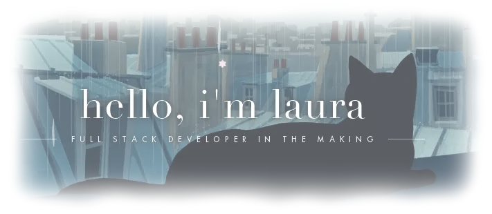
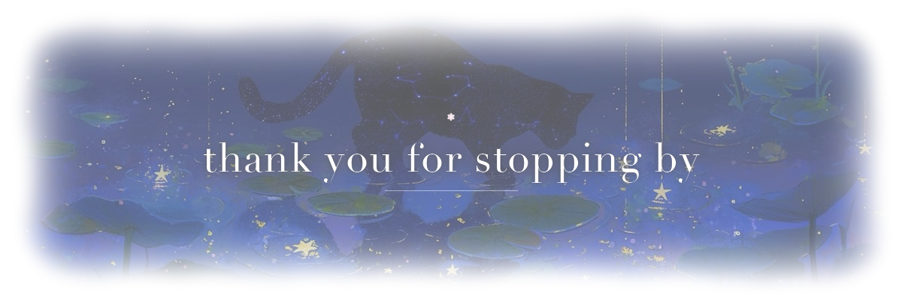

  

<h3>⋆˚✿˖° &nbsp; a b o u t &nbsp;&nbsp; m e &nbsp; °˖✿˚⋆</h3>

<b>❀ &nbsp; currently working on</b>
 
Full Stack Web Development intern at <b>Evologi</b> (Meolo),
 
now starting my second year at <b>ITS Digital Academy Mario Volpato</b>

<b>❀ &nbsp; currently learning</b>
 
JavaScript, Node.js, RESTful APIs and the Model Context Protocol (MCP)

<b>❀ &nbsp; fun fact</b>
 
I play the piano in my free time, and you'll also find me at the gym

 

. ݁₊ ⊹ . ݁˖ . ݁ &nbsp; ❀ &nbsp; . ݁ . ˖݁ . ⊹ ₊݁ .

  

<h3>⋆˚✿˖° &nbsp; t e c h &nbsp;&nbsp; s t a c k &nbsp; °˖✿˚⋆</h3>

<b>❀ &nbsp; languages</b>
 
JavaScript &nbsp;·&nbsp; Java &nbsp;·&nbsp; Python &nbsp;·&nbsp; HTML5

<b>❀ &nbsp; back end &amp; data</b>
 
Node.js &nbsp;·&nbsp; MySQL &nbsp;·&nbsp; Three.js &nbsp;·&nbsp; Vercel

<b>❀ &nbsp; design &amp; creative</b>
 
Figma &nbsp;·&nbsp; Canva &nbsp;·&nbsp; Blender

 

