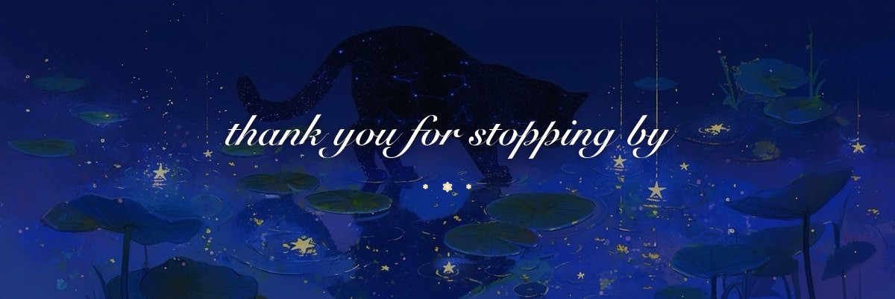

   
. ݁₊ ⊹ . ݁˖ . ݁ ⋆ ❀ ⋆ . ݁ . ˖݁ . ⊹ ₊݁ .

°❀⋆.ೃ࿔:･    a b o u t     m e    ･:࿔ೃ.⋆❀°
⋆˚✿˖°   currently working on  ·  Full Stack Web Development intern at Evologi (Meolo), now starting my second year at ITS Digital Academy Mario Volpato

⋆˚✿˖°   currently learning  ·  JavaScript, Node.js, RESTful APIs and the Model Context Protocol (MCP), growing my full stack skills

⋆˚✿˖°   fun fact  ·  I play the piano in my free time, and you'll also find me at the gym

 
. ݁₊ ⊹ . ݁˖ . ݁ ⋆ ❀ ⋆ . ݁ . ˖݁ . ⊹ ₊݁ .

❀˖°    t e c h     s t a c k    °˖❀
. ݁₊ ⊹ languages ⊹ ₊݁ .    JavaScript  ❀  Java  ❀  Python  ❀  HTML5

. ݁₊ ⊹ back end & data ⊹ ₊݁ .    Node.js  ❀  MySQL  ❀  Three.js  ❀  Vercel

. ݁₊ ⊹ design & creative ⊹ ₊݁ .    Figma  ❀  Canva  ❀  Blender

   

